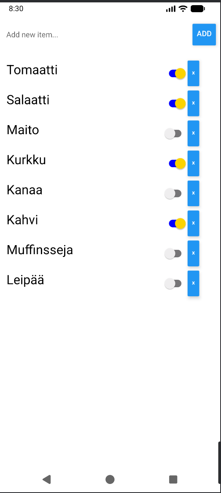

# Firebase Shopping List

Exercise for Oulu University of Applied Sciences Mobile Programming with Web and Hybrid Technologies course.

This is a rather simple shopping list app. You can add and remove items, and you can also mark items you already picked up.
List is updated via Firebase, and changes are updated in real time, so you could collaborate on your shopping needs. Even the state for found items is updated into the database.

ShoppingList/envtemplate.txt holds the required fields for Firebase Config. Fill those, and change filename to .env.

Screenshot of the app running on an emulator:

